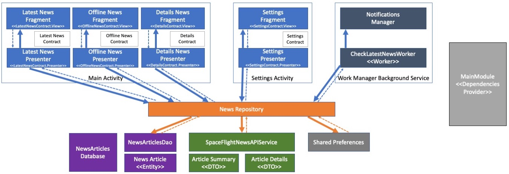

# Android Application Overview

This application is a "newsfeed" application example that allows displaying news from https://spaceflightnewsapi.net using public API provided by the website.

The application provides the following features:
* Ability to display the latest news from the feed
* Ability to view news details
* Ability to store selected news for the offline reading
* Ability to customize application UI via settings
* Ability to subscribe for periodic notifications about the news updates
* Ability to copy news article link to the clipboard and/or open via external browser

# Application Requirements Checklist

| Requirement | Status | How Was Implemented |
|:-----------:|:------:|:-------------------:|
| Use of at least two Activities | ✅ | Implemented MainActivity and SettingsActivity |
| Use of at least one Service | ✅ | Indirectly using Service via WorkManager architecture component to enable periodic news updates checks in the background. (Under the hood WorkManager uses an underlying job dispatching service) |
| The usage of the MVP | ✅ | Each screen has the corresponding Views (implemented by Fragments and Activities) and Presenter classes. Model related classes are located in the separate package and accessed via Repository. Repository is retrieving the data from 3 data source types (local database, network, preferences) |
| Use of REST API | ✅ | Accessing REST APIs provided by https://spaceflightnewsapi.net. Using Retrofit for data retrieval and Jackson for data deserialization. |
| Usage of at least five UI components from the Android Material Design Component Library | ✅ | Application is built using components provided by Android Material Design component library. Example components used in the app: Toolbar / Collapsing Toolbar, Lists (Recycler View), Bottom Navigation, FAB, Switch, CircularProgressIndicator, Snackbar and others. |
| The usage of data persistence like Android Room | ✅ | Offline data is stored using Android Room persistence library |

# Application UI Design

Application UI is built using Android Material Design Component Library and using Theme.MaterialComponents.Light.DarkActionBar theme and Material component styles across the board.

## News List Screen
  

News list displays the list of news articles received via API
* It uses RecyclerView + SwipeRefreshLayout to display the list of news articles
* Components provide corresponding loading, refresh and list items update animations
* Pull-to-refresh functionally allows to refresh the data in the list
* Tapping on the list item allows to navigate to the Details screen 
* In case application is offline, special "offline" view is displayed instead of the list
* In case of errors, "error" view is displayed instead of the list
* Each news list item downloads the corresponding news item thumbnail from the Internet (can be disabled via Settings screen)

## Offline News Screen
 

Offline News displays the list of news articles stored locally
* It uses RecyclerView to display the data
* It is possible to swipe the list item to remove it from the list (with animation)
* It is possible to tap the list item to navigate to the Details screen
* In case there are no items in the list, "empty" view is displayed instead of the list

## News Details Screen

Details screen displays the details of the selected news article
* It uses collapsing toolbar to preview the image of the news article
* If toolbar is collapsed, corresponding image is hidden and fab button changes location to avoid conflict with the menu items
* It allows the user to copy news Url to the clipboard
* It allows the user to open news Url with external browser

## Settings Screen

Settings screen allows the user to configure application settings such as:
* *Visibility of the Thumbnails* - if disabled, list no longer displays the corresponding thumbnails for the news articles
* *Background Refresh* - if enabled, application will launch a background service to periodically check if server has any new news articles. In case server has news that are newer than the user has seen, it will display the local notification

## Notification

Notification is displayed every time when the background service detects that server has new data. It allows the user to return to the application by tapping on the notification

## Overall Navigation

For overall navigation application is using Navigation Component + Navigation Graph as follows:

Application entry point is MainActivity that contains bottom view navigation and is responsible for navigation graph as well as switching between Live news and Saved news tabs.

# High Level Architectural Overview

Overall application, per task requirements, is using MVP architecture. The following diagram represents high level application architecture

Application has 2 activities (Main and Settings) that are entry points and responsible for top level navigation. As application is built using navigation components, it is using fragment based navigation, as result activities contain minimum logic. 

Each screen (view) displayed to the user in the application is represented by 3 components
* **<Screen>Contract** (e.g. LatestNewsContract) that defines interfaces for the screen's View and the screen's Presenter
* **<Screen>Contract.View** that is implemented by **<Screen>Fragment** class that is responsible for UI logic (e.g. LatestNewsFragment) 
* **<Screen>Contract.Presenter** that is implemented by **<Screen>Presenter** class (e.g. LatestNewsPresenter) that is responsible for managing UI and retrieving data from the model (via repository)

Model Layer consists of 
* **Repository** - responsible for the data retrieval from/to various data providers such as API, database and settings
* Database (Room)
    * **NewsArticlesDao** - responsible for executing database queries
    * **NewsArticle** - Entity that is stored in the data base / application representation of the news object
* API (Retrofit)
    * **SpaceFlightNewsAPIService** - responsible for the data retrieval from API and deserialization
    * **ArticleSummary** and **ArticleDetails** - data transfer object that represent models on the server side
* **SharedPreferences** (Android Component) - stores user preferences locally on the device

Application Service
* **CheckLatestNewsWorker** - A class that can perform check for latest news asynchronously in the background service via *WorkManager*
* **NotificationManager** - responsible for displaying the local notifications 

Apart from the main application classes there are several base classes
* Base MVP Classes
    * **BaseContract** - defines common interface for View-Presenter contract
    * **BasePresenter** - responsible for handling common "presenter" fragment logic
    * **BaseFragment** - responsible for handling common "view" fragment logic
* **BaseNavigationFragment** - responsible for handing common navigation component logic
* **BindingAdapters** - set of custom data binding adapters for DataBinding
* **MainModule** - provides (constructs) dependencies for dependency injection

## Additional Technologies Used

This application is 100% Kotlin based and demonstrates the use of the following technologies:
* [Material Design Component Library](https://material.io/develop/android) for building UI aligned with material design guidelines
* [DataBinding](https://developer.android.com/topic/libraries/data-binding) for defining layouts in declarative format
* [Navigation Component](https://developer.android.com/guide/navigation/navigation-getting-started) for navigation
* [Hilt](https://developer.android.com/training/dependency-injection/hilt-android) for Dependency Injection
* [Coroutines](https://developer.android.com/kotlin/coroutines) for making async calls to APIs and Database
* [Room](https://developer.android.com/training/data-storage/room) for working with data stored in the Database
* [Retrofit](https://square.github.io/retrofit/) for data retrieval
* [Jackson](https://github.com/FasterXML/jackson) for JSON data deserialization
* [Picasso](https://github.com/square/picasso) for loading thumbnails
* [WorkManager](https://developer.android.com/topic/libraries/architecture/workmanager) to schedule background services
* [Android Studio sample data resources](https://developer.android.com/studio/write/tool-attributes#toolssample_resources) to preview actual data in design time
